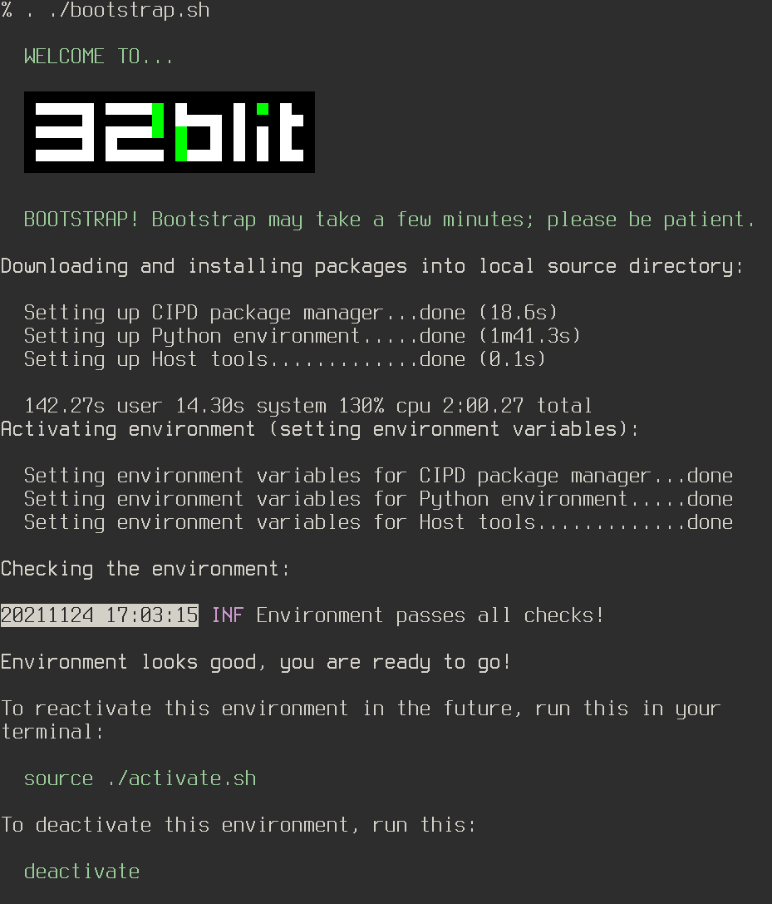

# 32blit Project

## Clone the repo

```sh
git clone https://github.com/AnthonyDiGirolamo/heliopause.32blit
cd heliopause.32blit

git submodule update --init
cd third_party/pico-sdk
git submodule update --init
cd ../../third_party/pico-extras
git submodule update --init
```

## Install the toolchains

This step downloads compilers and tools like `arm-none-eabi-gcc` and `cmake`. It also creates a Python virtualenv and installs the `32blit-tools` package.

The first run will take a while. Everything will be installed inside the project directory under `.environment`.

**Linux or Mac**

```sh
. ./bootstrap.sh
```

**Windows**

```sh
bootstrap.bat
```



The downloads are handled using [CIPD](https://chromium.googlesource.com/infra/luci/luci-go/+/refs/heads/main/cipd/). Artifacts are cached (usually in `~/.cipd-cache-dir`) so subsequent bootstrap runs will be faster. To see the full list of installed packages see [the json files in this directory](https://cs.opensource.google/pigweed/pigweed/+/master:pw_env_setup/py/pw_env_setup/cipd_setup/pigweed.json).

More info on bootstrap can be found in the [Pigweed Getting Started docs](https://pigweed.dev/docs/getting_started.html).

## Build all the things

1. Activate the environment

   After the first bootstrap you can run.

   ```sh
   . ./activate.sh
   ```

   To update your shell's environment variables and `PATH`.

2. Compile

   If you have the [fish shell](https://fishshell.com/) installed just run `go.fish`. Otherwise you can build your 32blit project as normal.

   ```sh
   mkdir -p build
   cmake -G Ninja -S ./ -B ./build
   ninja -C build
   ```
